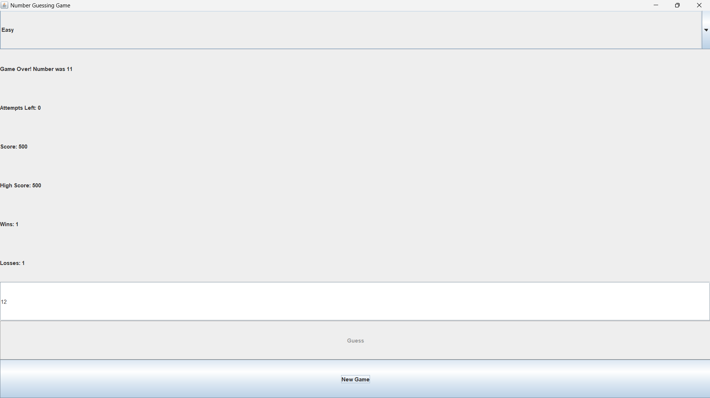

# 🎯 Number Guessing Game (Java Swing)

A professional GUI-based Number Guessing Game built using **Java Swing**.  
The project demonstrates core Java concepts like OOP, event handling, GUI design, and game logic implementation.

---

## 🧠 Project Overview

The game generates a random number and challenges the player to guess it within a limited number of attempts based on difficulty level.  
It includes scoring, win/loss tracking, and dynamic difficulty adjustment.

---

## ✨ Features

- 🎮 Interactive Java Swing GUI
- 🎚️ 3 Difficulty Levels:
  - Easy (1–50, 10 attempts)
  - Moderate (1–100, 8 attempts)
  - Hard (1–500, 6 attempts)
- 🧠 Intelligent feedback system (Too High / Too Low)
- 🏆 High Score tracking system
- 📊 Win / Loss statistics
- 💯 Score calculation based on performance
- 🔄 Reset / New Game functionality
- ⚡ Real-time UI updates

---

## 🖼️ UI Preview



---

## 🧱 Tech Stack

- Java (JDK 8+)
- Swing (GUI Framework)
- AWT Event Handling
- ThreadLocalRandom (Random Number Generation)

---
```markdown id="better2"
## 📁 Project Structure

Number Guessing Game/
│
├── src/
│ └── com/guessinggame/Main.java
│
├── bin/
│ └── (compiled files - ignored in GitHub)
│
├── screenshots/
│ └── game-ui.png
│
├── README.md
├── .gitignore

```

---

## 🚀 How to Run

### 1️⃣ Compile the project
```bash
javac -d bin src/com/guessinggame/Main.java
```
### 2️⃣ Run the project
```bash
java -cp bin com.guessinggame.Main
```

---

## 🧠 Key Concepts Used

- Object-Oriented Programming (OOP)
- Java Swing GUI development
- Event-driven programming
- Random number generation
- State management (attempts, score, wins/losses)

---

## 📈 Future Improvements

- 🏅 Add leaderboard with file storage
- ⏱️ Add timer-based challenge mode
- 🔊 Add sound effects for win/lose
- 🌐 Convert into web-based version (Spring Boot + React)
- 👥 Multiplayer mode

---

## 👨‍💻 Author
```markdown
<<h3 align="center">Rajana Rohit</h3>

<p align="center">
CSE Student | IIT Tirupati <br>
Passionate about building real-world Java projects
</p>
```
---